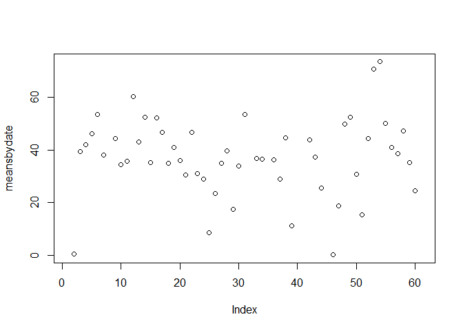
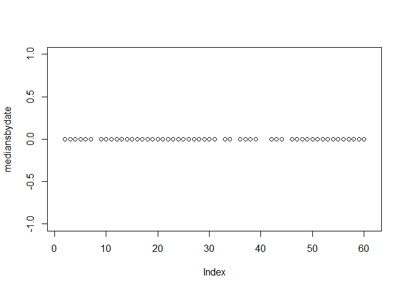
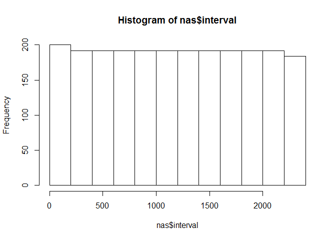
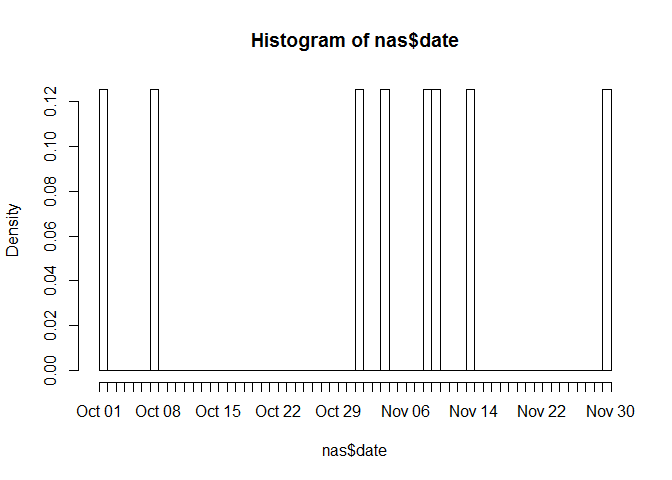

# Reproducible Research: Peer Assessment 1


```r
act <- read.csv(unzip("activity.zip"))
act$date = as.Date(act$date)
act$workday = as.factor(ifelse(weekdays(act$date) %in% c("Saturday","Sunday"), "Weekend", "Weekday"))
str(act)
```

```
## 'data.frame':	17568 obs. of  4 variables:
##  $ steps   : int  NA NA NA NA NA NA NA NA NA NA ...
##  $ date    : Date, format: "2012-10-01" "2012-10-01" ...
##  $ interval: int  0 5 10 15 20 25 30 35 40 45 ...
##  $ workday : Factor w/ 2 levels "Weekday","Weekend": 1 1 1 1 1 1 1 1 1 1 ...
```

```r
summary(act)
```

```
##      steps             date               interval         workday     
##  Min.   :  0.00   Min.   :2012-10-01   Min.   :   0.0   Weekday:12960  
##  1st Qu.:  0.00   1st Qu.:2012-10-16   1st Qu.: 588.8   Weekend: 4608  
##  Median :  0.00   Median :2012-10-31   Median :1177.5                  
##  Mean   : 37.38   Mean   :2012-10-31   Mean   :1177.5                  
##  3rd Qu.: 12.00   3rd Qu.:2012-11-15   3rd Qu.:1766.2                  
##  Max.   :806.00   Max.   :2012-11-30   Max.   :2355.0                  
##  NA's   :2304
```

```r
head(act[act$interval==1200,],10)
```

```
##      steps       date interval workday
## 145     NA 2012-10-01     1200 Weekday
## 433      0 2012-10-02     1200 Weekday
## 721     97 2012-10-03     1200 Weekday
## 1009   160 2012-10-04     1200 Weekday
## 1297   138 2012-10-05     1200 Weekday
## 1585   221 2012-10-06     1200 Weekend
## 1873    18 2012-10-07     1200 Weekend
## 2161    NA 2012-10-08     1200 Weekday
## 2449   211 2012-10-09     1200 Weekday
## 2737     7 2012-10-10     1200 Weekday
```

## What is mean total number of steps taken per day?

```r
meansbydate = tapply(act$steps, as.factor(act$date), mean, na.rm=TRUE)
mediansbydate = tapply(act$steps, as.factor(act$date), median, na.rm=TRUE)
sumbydate = tapply(act$steps, as.factor(act$date), sum, na.rm=TRUE)
sumbyinterval = tapply(act$steps, as.factor(act$interval), sum, na.rm=T)
mediansbyinterval = tapply(act$steps, as.factor(act$interval), median, na.rm=TRUE)

hist(sumbydate)
```

 

```r
plot(meansbydate)
```

 

```r
plot(mediansbydate)
```

 

```r
nas = act[is.na(act$steps),]
hist(nas$interval)
```

 

```r
hist(nas$date, breaks=61)
```

 

## What is the average daily activity pattern?


## Imputing missing values


## Are there differences in activity patterns between weekdays and weekends?
