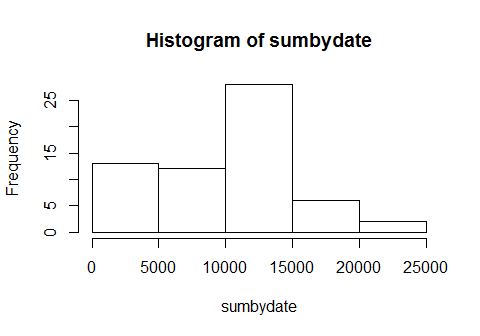
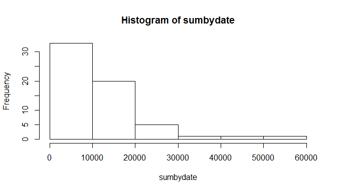
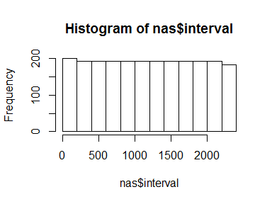
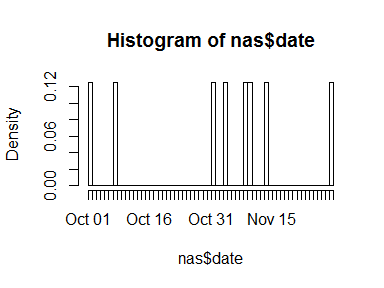
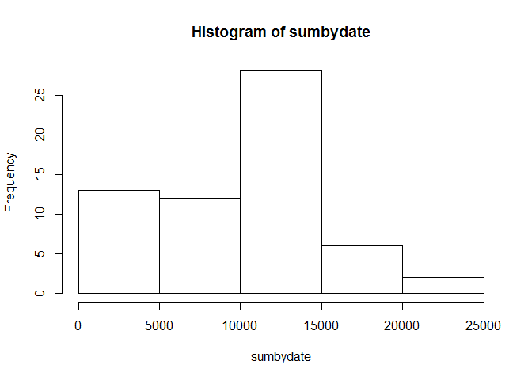
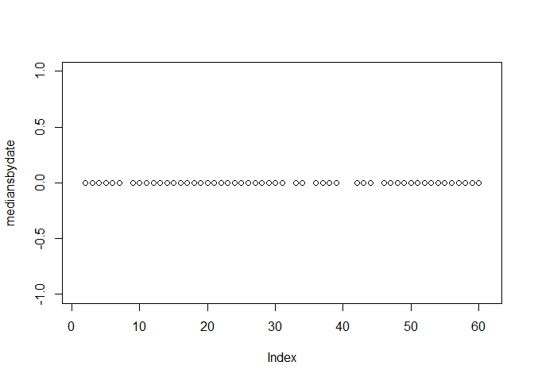

# Reproducible Research: Peer Assessment 1
Martin Smith  

Date: Sun Nov 16 17:57:00 2014

##Introduction
This is a submission for a peer-assessed assignment in the Coursera *Reproducible Research* course offered by Johns Hopkins University. The assignment makes use of data from a personal activity monitoring device. This device collects data at 5 minute intervals through out the day. The data consists of two months of data from an anonymous individual collected during the months of October and November, 2012 and include the number of steps taken in 5 minute intervals each day.  

The data file for analysis and the specific questions to be answered were provided by the course instructors.

##Data preparation
The source data is unzipped and read in to the *act* data frame; the *date* column is converted to data type *date*.  The *act* object is briefly examined to verify the variable data types, number of observations, and value ranges are as expected. 


```r
act <- read.csv(unzip("activity.zip"))
act$date = as.Date(act$date)
act$interval = as.character(act$interval)
str(act)
```

```
## 'data.frame':	17568 obs. of  3 variables:
##  $ steps   : int  NA NA NA NA NA NA NA NA NA NA ...
##  $ date    : Date, format: "2012-10-01" "2012-10-01" ...
##  $ interval: chr  "0" "5" "10" "15" ...
```

```r
summary(act)
```

```
##      steps             date              interval        
##  Min.   :  0.00   Min.   :2012-10-01   Length:17568      
##  1st Qu.:  0.00   1st Qu.:2012-10-16   Class :character  
##  Median :  0.00   Median :2012-10-31   Mode  :character  
##  Mean   : 37.38   Mean   :2012-10-31                     
##  3rd Qu.: 12.00   3rd Qu.:2012-11-15                     
##  Max.   :806.00   Max.   :2012-11-30                     
##  NA's   :2304
```

**Notable:  
There are 2304 "NA" values  
The median of all *steps* values is 0**  
----------------  


##Question 1: What is mean total number of steps taken per day?

*Instructions: What is mean total number of steps taken per day? (Ignore missing values.)*  

*First part: Make a histogram of the total number of steps taken each day*


```r
sumbydate = tapply(act$steps, as.factor(act$date), sum, na.rm=TRUE)
hist(sumbydate)
```

 
  
**Interpretation: This figure provides the distribution of daily step totals for the 61 days in the data sample.  Thus the sum of the frequencies = 61.  
Results: The most common daily step total, by far, is between 10,000 and 15,000 steps.**


*Second part: Calculate and report the mean and median total number of steps taken per day*  


```r
meanstepsbyday = round(mean(sumbydate), digits=1)
medianstepsbyday = median(sumbydate)
```
**Mean of total steps per day: 9354.2  
Median of total steps per day: 10395**  

-------------


##Question 2: What is the average daily activity pattern?

*Instructions:*  

*Make a time series plot (i.e. type = "l") of the 5-minute interval (x-axis) and the average number of steps taken, averaged across all days (y-axis)*  
  
*Which 5-minute interval, on average across all the days in the dataset, contains the maximum number of steps?*  


```r
require("ggplot2")
```

```
## Loading required package: ggplot2
```

```r
meansbyinterval = tapply(act$steps, as.integer(act$interval), mean, na.rm=T)
mbi = as.data.frame(meansbyinterval)
names(mbi)[1]="mean.steps"
mbi$interval = as.integer(row.names(mbi))
qplot(interval, mean.steps, data=mbi, geom="line")
```

 

**Results: The subject's activity peaks sharply in the morning--no surprise. Plot is slightly distorted since intervals are treated as integers vs. hours:minites, so there's a gap in the sequence every hour.**


```r
maxinterval = mbi[mbi$mean.steps==max(mbi$mean.steps),]
```

**Results: The maximum interval average number of steps is 206.2,**
**at interval 835**

--------

## Imputing missing values

*Instructions: There are missing values (coded as NA). This may introduce bias into some calculations or summaries of the data.*

*Calculate and report the total number of missing values in the dataset (i.e. the total number of rows with NAs)*

*Devise a strategy for filling in all of the missing values in the dataset.*

*Create a new dataset with the missing data filled in.*

*Make a histogram of the total number of steps taken each day and Calculate and report the mean and median total number of steps taken per day.* 
    
*Do these values differ from the estimates from the first part of the assignment? What is the impact of imputing missing data on the estimates of the total daily number of steps?*
    

```r
nas = act[is.na(act$steps),]
nalen = length(nas$steps)
```
--------------- 

**Result1: There are 2304 NAs in the data.**

**Result2: Strategy for imputing values to NAs--Based on making histograms of the observations with NA values in the steps variable** (see *Additional and Supporting Analyses*, below) **the best imputation strategy is to fill in missing values based on the average across all days of the steps taken in the interval corresponding to the missing value.**  


```r
act2 = merge(act, mbi, by="interval", all.x=TRUE)
act2$steps = ifelse(is.na(act2$steps)==TRUE, act2$mean.steps, as.integer(act2$steps))
act2$mean.steps = NULL
summary(act2)
```

```
##    interval             steps             date           
##  Length:17568       Min.   :  0.00   Min.   :2012-10-01  
##  Class :character   1st Qu.:  0.00   1st Qu.:2012-10-16  
##  Mode  :character   Median :  0.00   Median :2012-10-31  
##                     Mean   : 37.38   Mean   :2012-10-31  
##                     3rd Qu.: 27.00   3rd Qu.:2012-11-15  
##                     Max.   :806.00   Max.   :2012-11-30
```

```r
str(act2)
```

```
## 'data.frame':	17568 obs. of  3 variables:
##  $ interval: chr  "0" "0" "0" "0" ...
##  $ steps   : num  1.72 0 0 0 0 ...
##  $ date    : Date, format: "2012-10-01" "2012-11-23" ...
```

**Result3: new dataset act2 has no NAs.**  


```r
sumbydate = tapply(act2$steps, as.factor(act$date), sum, na.rm=TRUE)
hist(sumbydate)
```

 
  
**Interpretation: This figure provides the distribution of daily step totals for the 61 days in the data sample.  Thus the sum of the frequencies = 61.  
Results: The most common daily step total, by far, is between 10,000 and 15,000 steps.**


*Second part: Calculate and report the mean and median total number of steps taken per day*  


```r
meanstepsbyday = round(mean(sumbydate), digits=1)
medianstepsbyday = median(sumbydate)
```
**Mean of total steps per day: 1.07662\times 10^{4}  
Median of total steps per day: 9127.5849057**  


## Are there differences in activity patterns between weekdays and weekends?


```r
act$workday = as.factor(ifelse(weekdays(act$date) %in% c("Saturday","Sunday"), "Weekend", "Weekday"))
str(act)
```

```
## 'data.frame':	17568 obs. of  4 variables:
##  $ steps   : int  NA NA NA NA NA NA NA NA NA NA ...
##  $ date    : Date, format: "2012-10-01" "2012-10-01" ...
##  $ interval: chr  "0" "5" "10" "15" ...
##  $ workday : Factor w/ 2 levels "Weekday","Weekend": 1 1 1 1 1 1 1 1 1 1 ...
```

```r
head(act[act$interval==1200,],10)
```

```
##      steps       date interval workday
## 145     NA 2012-10-01     1200 Weekday
## 433      0 2012-10-02     1200 Weekday
## 721     97 2012-10-03     1200 Weekday
## 1009   160 2012-10-04     1200 Weekday
## 1297   138 2012-10-05     1200 Weekday
## 1585   221 2012-10-06     1200 Weekend
## 1873    18 2012-10-07     1200 Weekend
## 2161    NA 2012-10-08     1200 Weekday
## 2449   211 2012-10-09     1200 Weekday
## 2737     7 2012-10-10     1200 Weekday
```


##Additional and supporting analyses

###What is the pattern of "NA" values in the data?
This question informs the strategy for imputing values to "NA"s.  Here are frequencies of "NA"s by interval and by date.


```r
##Subset out observations where steps=="NA"
nas = act[is.na(act$steps),]
nas$interval = as.integer(nas$interval)
hist(nas$interval)
```

 

```r
##Specify breaks=61 because there are 61 days in the data
hist(nas$date, breaks=61)
```

 
  
**Conclusion: "NA"s are grouped entirely in specific dates, as though the subject just took some days off (or maybe forgot his step-meter!) The implicaton is that it is probably best to impute a distribution of steps values for the NAs based on the overall average number of steps by interval.**

   
